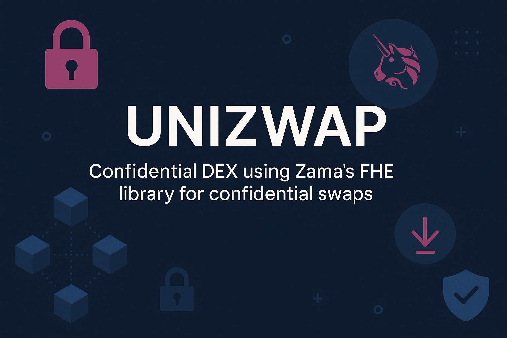

# Unizwap: Confidential AMM Code with Proposed Solution

## 1. Introduction

- **Project Overview**: Implement a confidential Automated Market Maker (AMM) using homomorphic encryption for tokens.
- **Scope**: Run code locally via browser or hardhat tasks.

## 2. Unizwap

### 2.1 Core AMM Functionality

- **Swap Mechanism**:
  - Difficulty: Standard Uniswap V2 (constant product x\*y=k) requires division (encrypted/encrypted), unsupported in
    the current FHE library.
  - Proposed Solution: Use constant sum (linear) function x + y = k. Suitable for stablecoins (primary use case for
    confidential tokens) as it minimizes slippage.
  - Alternative (Not Implemented): Oracle-based swaps (feed oracle or user-provided input/output amounts matching pool
    balance) for accuracy, but deferred for speed.
- **Liquidity Provision**:
  - Add/remove liquidity maintaining encrypted balances.
  - Pool shares tracked as provided liquidity only (no division for proportional shares).
- **Fees Handling**:
  - Difficulty: Divisor problem prevents fee distribution (can't compute shares accurately in encrypted domain).
  - Proposed Solution: Allocate fees to pool owner.
  - Alternative: Set fees to 0 for simplicity.
- **Limitations**:
  - Linear AMM vulnerable to arbitrage for non-stable pairs (depeg).
  - Lack of incentivization for Liquidity Providers (LPs):
    - No direct fee rewards due to above-mentioned constraints.
    - Options: External rewards (e.g., governance tokens, yield farming integrations); owner-subsidized incentives; or
      hybrid models post-prototype (e.g., off-chain computation for distributions).

### 2.2 Local Execution

- **Testing**:
  - Simulate swaps with stablecoin pairs.
  - Verify balances post-swap using linear function.
  - Edge Cases: Add liquidity with uninitialized balances.

### 2.3 Deliverables

- Running task on local hardhat node.
- Extensive tests.
- Contracts deployed on Sepolia.

## DevX feedbacks

- Lost ~1h because of missing `SepoliaConfig`
- Conflicting `hardhat` network
  - need to start the node with `npx hardhat node (--network hardhat)`
  - need to run tasks with `--network localhost`
- ACL is cumbersome (no immediate better idea)
